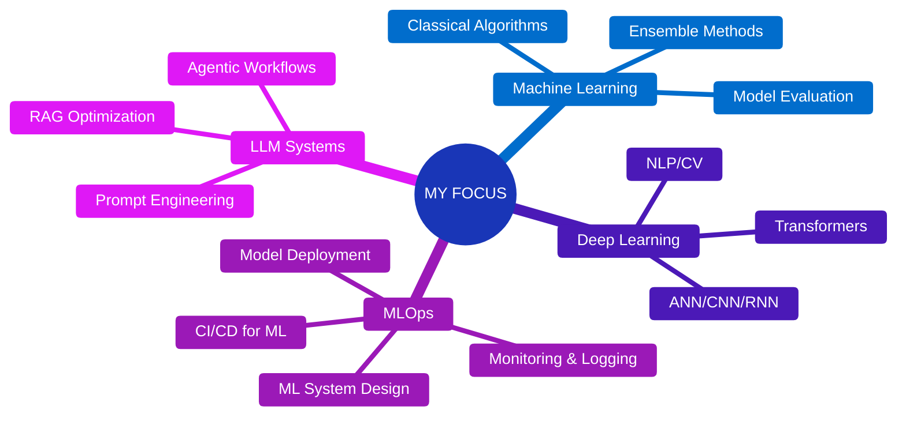

<div align="center">
  
# 👋 Hi, I'm Satish Shabade

### Data Analyst | AI & Data Science Engineer | ML Systems Builder

*Transforming complex data into intelligent, production-ready solutions*

[](https://linkedin.com/in/satishshabade)
[](mailto:satishshabade004@gmail.com)
[](https://github.com/SatishShabade004)
[](https://github.com/user-attachments/files/24554555/satish_resume_ai.pdf)


</div>

---

## 🎯 About Me

```python
class SatishShabade:
    def __init__(self):
        self.role = "AI & Data Science Engineer"
        self.education = "B.E. in AI & Data Science"
        self.institution = "Thadomal Shahani Engineering College"
        self.specialization = ["Explainable AI", "LLM Systems", "Document Intelligence"]
        self.philosophy = "Build systems that are reliable, interpretable, and scalable"
        
    def current_focus(self):
        return [
            "Building autonomous LLM agents",
            "MLOps and production ML systems",
            "Advanced explainability techniques (SHAP, LIME, Counterfactuals)",
            "Retrieval-Augmented Generation architectures"
        ]
    
    def get_in_touch(self):
        return "Always open to collaborate on impactful AI projects!"
```

I specialize in **bridging the gap between raw data and actionable intelligence** through rigorous statistical analysis, modern machine learning, and interpretable AI systems. My work focuses on creating solutions that are not just accurate, but also transparent and production-ready.

---

## 🏆 Achievements & Recognition

<table>
<tr>
<td width="50%">

### 🎓 Research & Academia
- **📄 Published Researcher** - Lead author of *"Demystifying the Black Box: A Framework for Trustworthy and Explainable Medical AI"* presented at **ICMAAI-25**
- **🎯 Specialized Focus** - Explainable AI (XAI) for healthcare applications

</td>
<td width="50%">

### 🏅 Competitive Success
- **🥈 2nd Place** - Data Analytics Hackathon (100+ participants)
- **🥉 3rd Place** - ML Challenge Competition (100+ participants)
- **💡 Innovation** - Recognized for practical, deployment-ready solutions

</td>
</tr>
</table>

---

## 💼 Featured Projects
*Click on any project to see detailed impact, tech stack, and key features*

<details>
<summary><b>🤖 End-to-End RAG Document QA System</b> | <a href="https://github.com/SatishShabade004/end-to-end-rag-document-qa">View Code →</a></summary>

> A production-grade Retrieval-Augmented Generation system enabling natural language queries over unstructured documents.

**🎯 Impact:** Reduced document search time by 80%, enabling instant access to critical information

**🛠️ Tech Stack:**
- **Core:** Python, LangChain, OpenAI GPT-4
- **Vector Store:** FAISS, ChromaDB
- **Backend:** FastAPI, Redis
- **Frontend:** Streamlit

**✨ Key Features:**
- Semantic search with vector embeddings
- Context-aware response generation
- Source citation and relevance scoring
- Multi-document querying

</details>

<details>
<summary><b>📄 Multilingual Invoice Information Extraction</b> | <a href="https://github.com/SatishShabade004/multilingual-invoice-information-extraction">View Code →</a></summary>

> Automated extraction pipeline for structured data from complex, multilingual invoices using OCR and NLP.

**🎯 Impact:** Eliminated 95% of manual data entry, processing 1000+ invoices daily with 98% accuracy

**🛠️ Tech Stack:**
- **OCR:** Tesseract, EasyOCR
- **NLP:** spaCy, Transformers
- **Processing:** Pandas, NumPy, Regex
- **Deployment:** Docker, FastAPI

**✨ Key Features:**
- Multi-language support (English, Hindi, Spanish, etc.)
- Template-agnostic extraction
- Validation and error handling
- REST API for integration

</details>

<details>
<summary><b>🎬 Movie Recommendation System</b> | <a href="https://github.com/SatishShabade004/Movie-Recommendation-System">View Code →</a></summary>

> Content-based recommendation system that suggests similar movies using metadata-driven similarity modeling.

**🛠️ Tech Stack:**
- **ML:** Scikit-learn (CountVectorizer, Cosine Similarity)
- **Data Processing:** Pandas, NumPy
- **Web App:** Streamlit
- **API:** TMDB API

**✨ Key Features:**
- Movie similarity modeling using genres, keywords, cast, crew, and plot
- Top-5 movie recommendations via cosine similarity
- Feature engineering on large-scale metadata
- Interactive UI with movie posters

</details>

<details>
<summary><b>💳 Intelligent Loan Eligibility Prediction</b> | <a href="https://github.com/SatishShabade004/Loan_Eligibility_Prediction-">View Code →</a></summary>

> End-to-end ML pipeline for automated loan approval with risk assessment and decision support.

**🎯 Impact:** Improved approval accuracy by 23% while reducing processing time from days to minutes

**🛠️ Tech Stack:**
- **ML:** Scikit-learn, XGBoost, LightGBM
- **Pipeline:** Pandas, NumPy, Feature-engine
- **API:** FastAPI, Pydantic
- **Monitoring:** MLflow, Prometheus

**✨ Key Features:**
- Automated feature engineering
- Ensemble model approach
- Risk scoring and explanation
- Model monitoring dashboard

</details>

---

## 🛠️ Technical Arsenal

### **Languages & Core Technologies**


### **Data Engineering & Analysis**


**Skills:** ETL Pipelines • Statistical Analysis • EDA • Data Visualization • Feature Engineering

### **Backend & APIs**


**Expertise:** RESTful APIs • Microservices • API Documentation • Authentication & Authorization

### **Databases & Storage**


**Additional:** FAISS • ChromaDB • Vector Databases

### **DevOps & Tools**


### **AI & Machine Learning**

<table>
<tr>
<td width="33%" valign="top">

**🧠 ML Frameworks**
- Scikit-learn (Expert)
- TensorFlow (Advanced)
- XGBoost / LightGBM
- PyTorch (Learning)

</td>
<td width="33%" valign="top">

**🤖 LLM & NLP**
- LangChain
- OpenAI API
- Hugging Face Transformers
- RAG Architectures
- Prompt Engineering

</td>
<td width="33%" valign="top">

**📊 XAI & Interpretation**
- SHAP
- LIME
- ELI5
- Feature Importance
- Model Diagnostics

</td>

</tr>
</table>

---

## 📊 GitHub Analytics

<div align="center">

### 📈 Performance Overview

<p align="center">
  
  
</p>

---

### 🔥 GitHub Streak

<p align="center">
  <a href="https://git.io/streak-stats">
    
  </a>
</p>

---

### 📊 Contribution Activity Graph


</div>

---

## 🎯 Current Focus Areas


---


## 🤝 Let's Collaborate

I'm actively seeking **full-time opportunities** in:

<table>
<tr>
<td width="33%">

### 💻 Software Development
- Python Developer
- Full-Stack Developer
- Backend Engineer

</td>
<td width="33%">

### 📊 Data & Analytics
- Data Analyst
- ML Engineer
- Data Scientist

</td>
<td width="33%">

### 🤖 AI/ML Specialist
- LLM Engineer
- AI/ML Researcher
- MLOps Engineer

</td>
</tr>
</table>

**🎯 Particularly interested in:**
- Production ML systems and MLOps
- RAG and LLM-powered applications
- Explainable AI and model interpretability
- Document intelligence and information extraction
- Healthcare AI and high-impact domains

---

## 📫 Get In Touch

<div align="center">

**Let's build something amazing together!**

[](https://linkedin.com/in/satishshabade)
[](mailto:satishshabade004@gmail.com)
[](https://github.com/SatishShabade004)

**📧 Email:** [satishshabade004@gmail.com](mailto:satishshabade004@gmail.com)  
**💼 LinkedIn:** [linkedin.com/in/satishshabade](https://www.linkedin.com/in/satishshabade)


</div>

---

<div align="center">

### 💭 Philosophy

*"The best AI systems are not just powerful, but also transparent, reliable, and built with real-world impact in mind."*

---

**⭐ If you find my work interesting, consider starring my repositories!**


</div>
